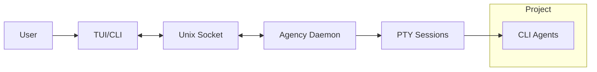
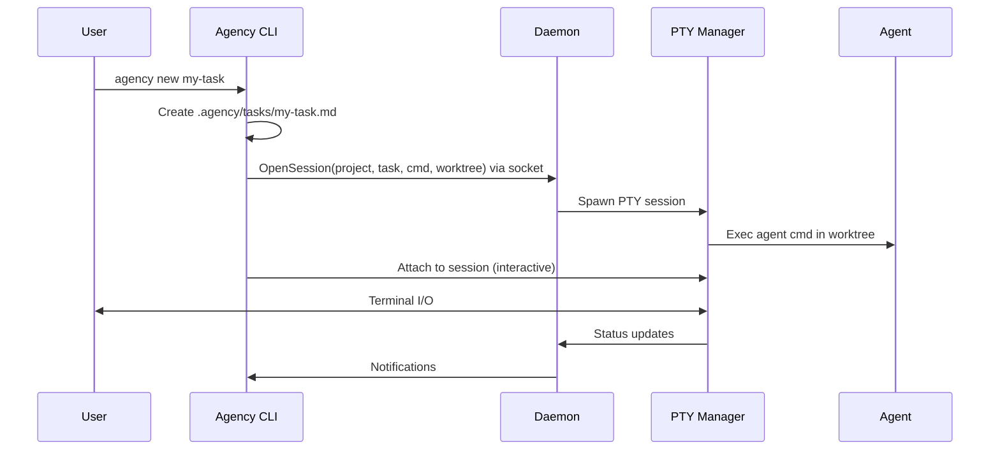

# Agency


[](https://www.npmjs.com/package/agency-cli)


Agency is an AI agent orchestrator running purely in the command line.

- User-friendly TUI heavily inspired by [Lazygit](https://github.com/jesseduffield/lazygit)
- CLI commands for easy automation
- Supports any CLI coding agent: [Claude Code](https://github.com/anthropics/claude-code), [Codex CLI](https://github.com/openai/codex), [Gemini CLI](https://github.com/google-gemini/gemini-cli), [OpenCode](https://github.com/sst/opencode) and [you can add more](#defining-a-custom-agent)
- Isolated environments for each task using Git worktrees

## Getting Started

1. Install Agency with your preferred method (macOS and Linux supported)
   - NPM: `npm install -g agency-cli`
   - Homebrew : `brew install tobias-walle/tap/agency`
   - Build from source: `cargo install --git https://github.com/tobias-walle/agency`
2. Set up your preferences: `agency setup`
3. Set up Agency in your project: `agency init`
4. Start the TUI: `agency`

## TUI or CLI: your choice

The easiest option is to use the TUI; run `agency tui` or just `agency`.


Everything available in the TUI is also available via the CLI:

- `agency --help` - See all available commands
- `agency new my-task` - Start a new task with slug `my-task`; opens your `$EDITOR` to describe what the agent should do.
- `agency new --draft my-task` - Create a new task as a draft (doesn't start it yet).
- `agency edit my-task` - Edit a draft task.
- `agency start my-task` - Start a task that is a draft or stopped.
- `agency attach my-task` or `agency attach 1` - Open the agent TUI by slug or ID.
- `agency stop my-task` - Stop a running task (keep its worktree and branch).
- `agency merge my-task` - Merge the task back into the base branch.
- `agency path my-task` - Get the worktree path for a task.
- `agency shell my-task` - Open a shell in the task's worktree.
- `agency ps` - List all tasks and their status.
- `agency daemon start|stop|restart` - Manage the background daemon that runs the agents.
- ... and many more (see `agency --help`).

## Configuration

Configuration is layered in three tiers:

1. Defaults (see [crates/agency/defaults/agency.toml](./crates/agency/defaults/agency.toml) or `agency defaults`)
2. Global file `~/.config/agency/agency.toml` (created by `agency setup`)
3. Project overrides at `./.agency/agency.toml`

### Defining a custom agent

You can define custom agents using any CLI command.

```toml
[agents.my-agent]
cmd = ["my-agent", "-p", "$AGENCY_TASK"]
```

The following environment variables are injected into the command:

- `$AGENCY_TASK` - The full prompt for the current task.
- `$AGENCY_ROOT` - The path to the folder of the main repo (not the worktree).

You can also use the `<root>` placeholder for relative paths (works in any config in which you define a path).

```toml
[agents.my-local-agent]
cmd = ["<root>./my-local-agent", "-p", "$AGENCY_TASK"]
```

Check out the [default config](./crates/agency/defaults/agency.toml) for a few examples.

## Architecture

Agency uses a daemon + client architecture. The daemon manages all PTY sessions that run the agents. Clients (CLI or TUI) communicate with the daemon via a Unix socket.

The socket is stored in one of the following locations:

- `$AGENCY_SOCKET_PATH` env override
- `daemon.socket_path` in config
- `$XDG_RUNTIME_DIR/agency.sock`
- `~/.local/run/agency.sock` (Default)



For example, when creating a new task the message flow between daemon and client looks like this:


