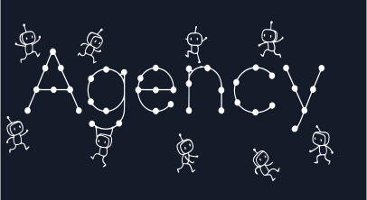
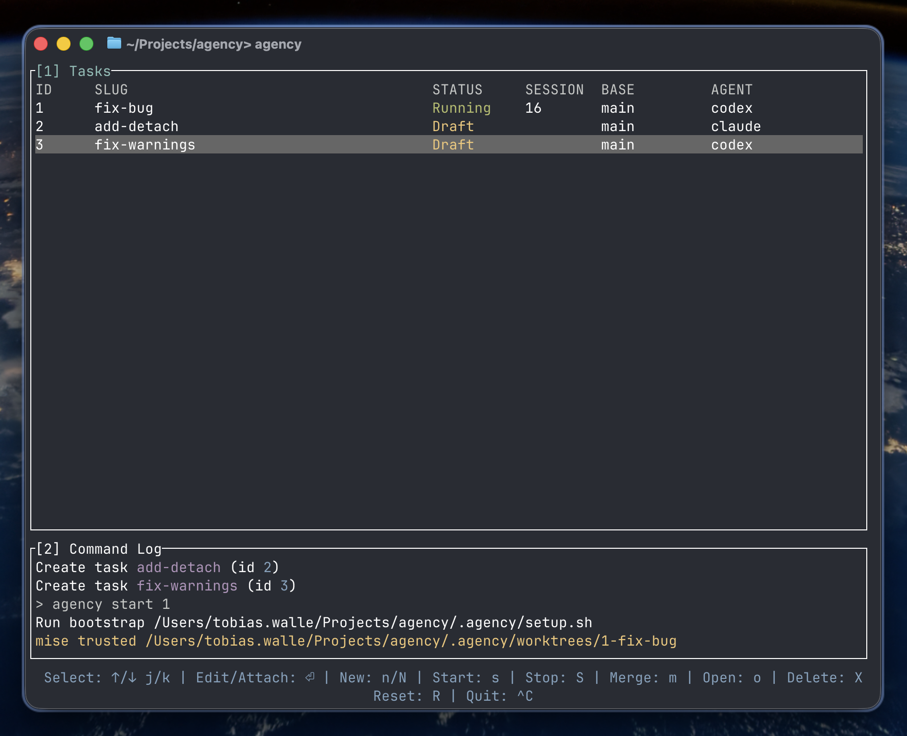
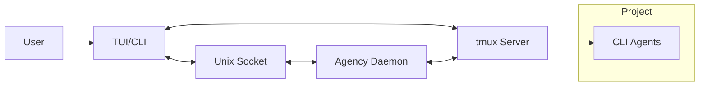
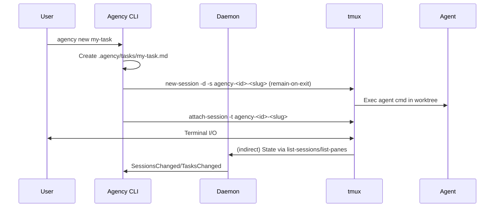

# Agency



[](https://www.npmjs.com/package/agency-cli)


Agency is an AI agent orchestrator running purely in the command line.

- User-friendly TUI heavily inspired by [Lazygit](https://github.com/jesseduffield/lazygit)
- CLI commands for easy automation
- Supports any CLI coding agent: [Claude Code](https://github.com/anthropics/claude-code), [Codex CLI](https://github.com/openai/codex), [Gemini CLI](https://github.com/google-gemini/gemini-cli), [OpenCode](https://github.com/sst/opencode) and [you can add more](#defining-a-custom-agent)
- Isolated environments for each task using [Git Worktrees](https://git-scm.com/docs/git-worktree) and [Tmux](https://github.com/tmux/tmux)

## Getting Started

1. Install Agency with your preferred method (macOS and Linux supported)
   - NPM: `npm install -g agency-cli`
   - Homebrew : `brew install tobias-walle/tap/agency`
   - Build from source: `cargo install --git https://github.com/tobias-walle/agency`
2. Set up your preferences: `agency setup`
3. Set up Agency in your project: `agency init`
4. Start the TUI: `agency`

## TUI or CLI: your choice

The easiest option is to use the TUI; run `agency tui` or just `agency`.



Everything available in the TUI is also available via the CLI:

- `agency --help` - See all available commands
- `agency new my-task` - Create a new task with slug `my-task`, start a session for it, and attach immediately (no editor by default).
- `agency new --draft my-task` - Create a new task as a draft (doesn't start or attach; in interactive TTY mode without a description, this opens your editor to write the initial instructions).
- `agency edit my-task` - Edit a draft task.
- `agency start my-task` - Start a task that is a draft or stopped.
- `agency attach my-task` or `agency attach 1` - Open the agent TUI by slug or ID.
- `agency attach --follow` - Attach to the focused task in a running Agency TUI.
- `agency stop my-task` - Stop a running task (keep its worktree and branch).
- `agency merge my-task` - Merge the task back into the base branch.
- `agency path my-task` - Get the worktree path for a task.
- `agency shell my-task` - Open a shell in the task's worktree.
- `agency tasks` - List all tasks and their status.
- `agency config` - Open the global Agency config in your editor.
- `agency daemon start|stop|restart` - Manage the background daemon that tracks sessions and notifies clients.
- ... and many more (see `agency --help`).

## Skills

Teach your AI coding agent how to use Agency by installing the Agency skill. Once installed, your agent will know how to parallelize tasks using Agency when you ask it to.

### Claude Code

```bash
/plugin marketplace add tobias-walle/agency
/plugin install agency@agency
```

```bash
# Alternative: install via Agency CLI
agency skill install
# When prompted, select: "Claude (~/.claude/skills)"
```

### Codex CLI and Others

```bash
agency skill install
# When prompted, select: "Codex (~/.codex/skills)" or a custom path
```

## Configuration

Configuration is layered in three tiers:

1. Defaults (see [crates/agency/defaults/agency.toml](./crates/agency/defaults/agency.toml) or `agency defaults`)
2. Global file `~/.config/agency/agency.toml` (created by `agency setup`)
3. Project overrides at `./.agency/agency.toml`

### Tmux

Agency uses Tmux to manage the background agents.

If you attach to an agent you are basically opening Tmux.

Config precedence when starting sessions:

1. User defaults (best-effort): `~/.tmux.conf`, then `~/.config/tmux/tmux.conf`
2. Agency defaults (baseline UI/options applied programmatically)
3. Agency global overrides: `~/.config/agency/tmux.conf`
4. Project overrides: `./.agency/tmux.conf`

### Defining a custom agent

You can define custom agents using any CLI command.

```toml
[agents.my-agent]
cmd = ["my-agent", "-p", "$AGENCY_TASK"]
```

The following environment variables are injected into the command:

- `$AGENCY_TASK` - The full prompt for the current task.
- `$AGENCY_ROOT` - The path to the folder of the main repo (not the worktree).
- `$AGENCY_TASK_ID` - The numeric ID of the task.

You can also use the `<root>` placeholder for relative paths (works in any config in which you define a path).

```toml
[agents.my-local-agent]
cmd = ["<root>./my-local-agent", "-p", "$AGENCY_TASK"]
```

Check out the [default config](./crates/agency/defaults/agency.toml) for a few examples.

### Editor

Control which editor Agency uses when opening files (e.g. task descriptions, worktrees, and config):

```toml
# Preferred editor argv. If unset, Agency falls back to $EDITOR, then to `vi`.
editor = ["nvim"]

# Examples:
# editor = ["code", "-w"]
# editor = ["zed", "--wait"]
```

You can also run `agency config` to open (and create if missing) the global config file directly in your editor.

## Architecture

Agency uses a daemon + client architecture with tmux-managed sessions. The daemon is slim: it computes session/task status from tmux and broadcasts notifications. Clients (CLI or TUI) communicate with the daemon via a Unix socket but attach directly to tmux for interactive views.

Daemon socket path precedence:

- `$AGENCY_SOCKET_PATH` env override
- `daemon.socket_path` in config
- `$XDG_RUNTIME_DIR/agency.sock`
- `~/.local/run/agency.sock` (Default)

Tmux socket path precedence (used for all sessions):

- `$AGENCY_TMUX_SOCKET_PATH` env override
- `daemon.tmux_socket_path` in config
- `$XDG_RUNTIME_DIR/agency-tmux.sock`
- `~/.local/run/agency-tmux.sock` (Default)



For example, when creating a new task the message flow between daemon and client looks like this:


